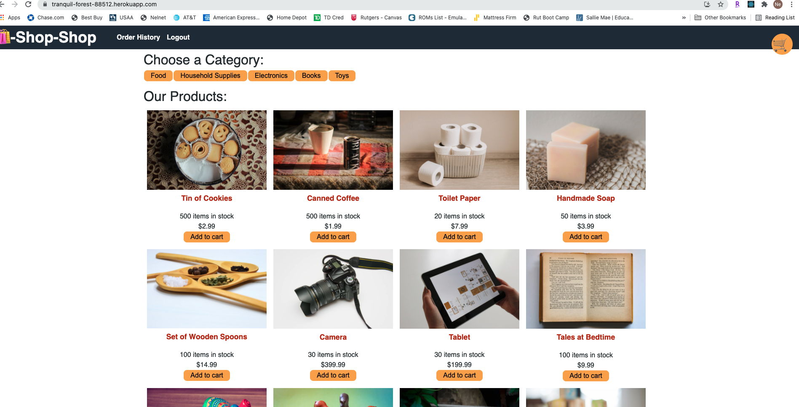

  # mernshop
  

  ## Description 
    * refactor the e-commerce platform from the module project so that it uses Redux (Links to an external site.). You won’t need to make sweeping changes to the code, but you will need to read through the Redux documentation on your own to find the information you need.
  ## Table of Contents (Optional)
  
  * [Installation](#installation)
  * [Usage](#usage)
  * [Credits](#credits)
  * [License](#license)

  ## Installation
    * To install: run from heroku https://tranquil-forest-88512.herokuapp.com/
    
  
  ## Usage 
    * Use this program by: use as you will
  
  
  
  
  ## Credits
   * The following folks helped with this project: me
  
  ## License
   * This project uses this license: https://opensource.org/licenses/MIT
  
  ## Badges
  
  * 
  
  ## Features
    * The project has the following features: redux, react, mongoose, etc.
  
  ## Contributing
    * If you'd contribute to this project, consider the following: none 
  ## Tests
    *none

  ## Questions?
  * Reach out to the repository owner spectocr, https://github.com/spectocr/bookish-waddle, or email at cris.spector@live.com